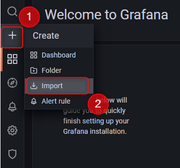
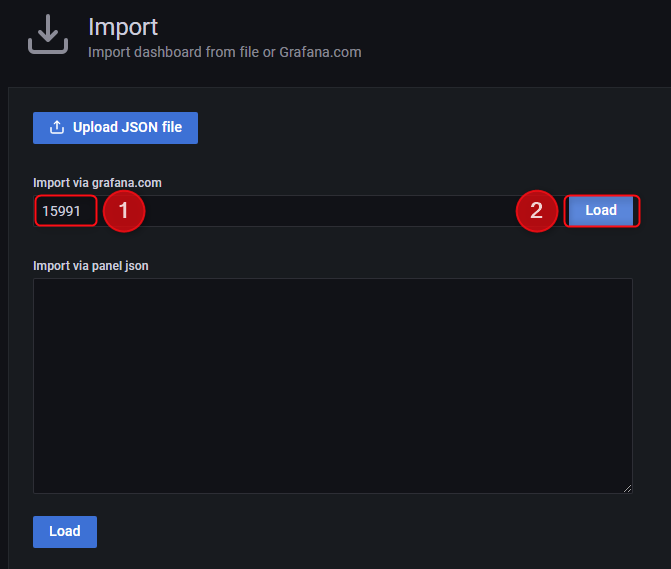
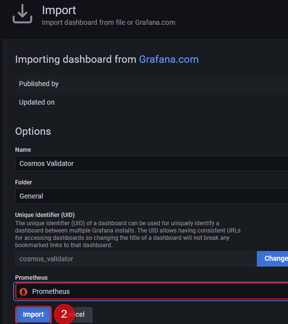
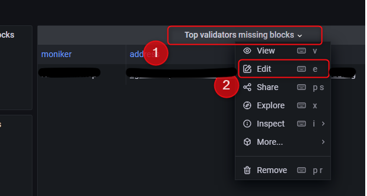
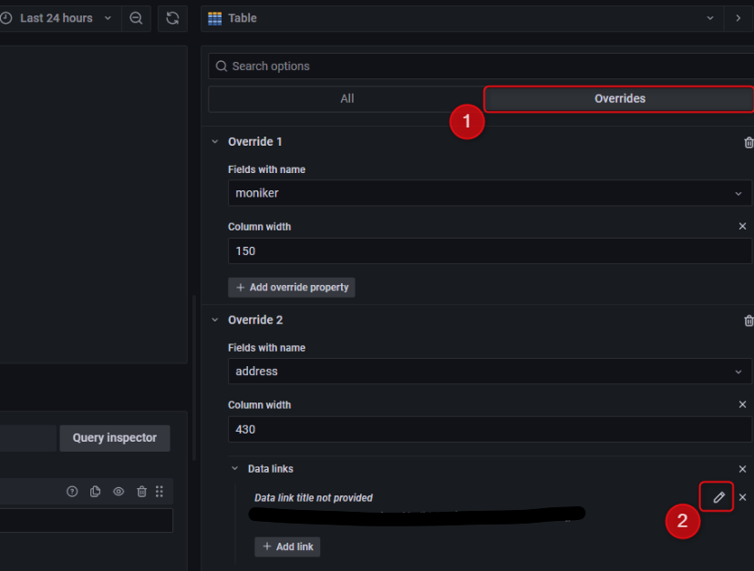
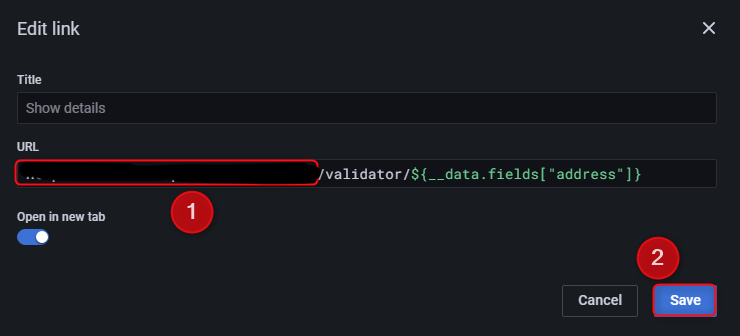

Deployment 

- Edit values.yaml
```bash
helm repo add prometheus-community https://prometheus-community.github.io/helm-charts 
helm install kube-prometheus-stack -n monitoring prometheus-community/kube-prometheus-stack -f values.yaml
```
On the kube-prometheus-stack is deployed successfully 
```bash
kubectl apply -f global-alertmanager-configuration.yaml
```

## Configuration

### Configure Grafana
1. Open Grafana in your web browser (using port forwarding). Grafana service is available on port `80`

2. Login using defaults username:admin and password:prom-operator and change password.

3. Import custom dashboard

3.1. Press "+" icon on the left panel and then choose **"Import"**



3.2. Input grafana.com dashboard id `15991` and press **"Load"**



3.3. Select Prometheus data source and press **"Import"**



4. Change your chain explorer url

4.1. Edit **"Top validators missing blocks panel"**



4.2. Go to **"Overrides"** and edit **"Data links"**



4.3 Change url to your chain data explorer and hit **"Save"**



4.4. Hit **"Save"** button on the left top corner to save changes to dashboard

Cosmos Validator Dashboard is now configured